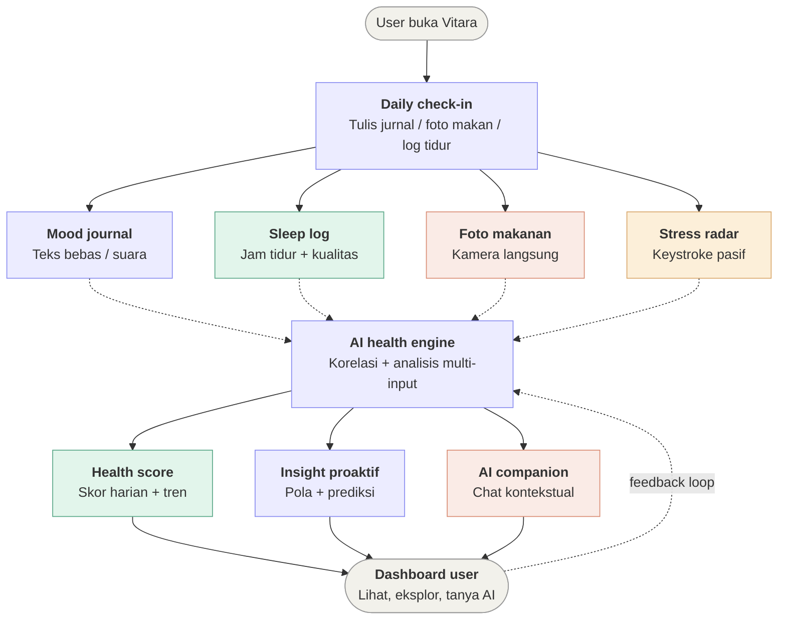
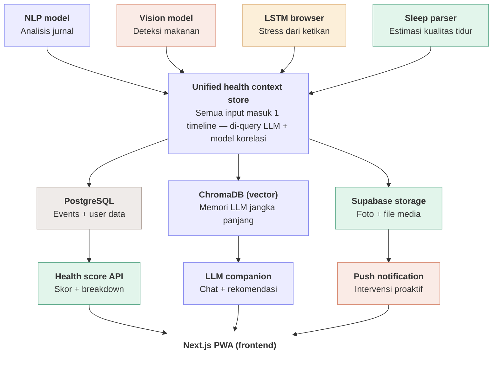

# Vitara - Your Whole Health, One Place

Platform kesehatan yang menggabungkan deteksi stres, kualitas tidur, gizi, dan mental health jadi satu ekosistem personal. Semua modul saling terhubung dan membentuk satu "health profile" yang berkembang tiap hari.

<aside>
🧠

**Mood & Mental Check**

Pengguna menulis jurnal harian bebas, lewat teks atau voice-to-text. Sistem lalu menganalisis pola bahasa, seperti keraguan, urgensi, dan pengulangan kata, untuk memetakan mood mingguan. Jika muncul pola tidak biasa, misalnya mood buruk beberapa hari berturut-turut, sistem mengirim pesan alert. Data ini juga dikaitkan dengan faktor lain, seperti kualitas tidur dan pengaruhnya terhadap mood hari berikutnya.

</aside>

<aside>
🌙

**Sleep Intelligence**

Pengguna mengisi jam tidur, jam bangun, dan kualitas tidur yang dirasakan. Sistem lalu menghubungkan data tersebut dengan mood, pola makan, dan tingkat stres untuk melihat hubungan yang sering muncul. Dari pola itu, sistem menyusun saran tidur yang sesuai dengan kebiasaan pengguna, misalnya: *“Kamu cenderung tidur kurang baik jika makan berat setelah jam 8 malam saat sedang stres.”* Saran ini diperbarui secara berkala berdasarkan data mingguan. 

</aside>

<aside>
🍽️

**Nutrition Lens**

Pengguna foto makanan, lalu sistem mengenali bahan dan estimasi porsinya untuk menghitung kandungan gizi. Data makanan ini kemudian dikaitkan dengan mood dan energi pada hari yang sama untuk melihat polanya, misalnya: *“Kamu cenderung merasa lemas di sore hari setelah makan tinggi karbohidrat saat siang.”* Hasilnya juga otomatis masuk ke penilaian kesehatan harian.

</aside>

<aside>
😮‍💨

**Stress Radar**

Pola mengetik seperti kecepatan, jeda, dan tingkat kesalahan dianalisis langsung di browser tanpa mengirim data ke luar perangkat. Jika tingkat stres terdeteksi tinggi, sistem memberi saran untuk berhenti sejenak dan mengatur napas. Data stres ini kemudian dihubungkan dengan modul lain, sehingga hari dengan stres tinggi ikut menjadi pertimbangan dalam jurnal mood dan rekomendasi tidur malam hari.

</aside>

---

### 👤 User Journey

---

### ⚙️ Data Layer

### 🎨 Mockup UI

[https://www.figma.com/design/so7jv2beTsQtDXo4PKIq8d/Vitara-UI?node-id=0-1&t=Ofa2OkXLzLm7k5t2-1](https://www.figma.com/design/so7jv2beTsQtDXo4PKIq8d/Vitara-UI?node-id=0-1&t=Ofa2OkXLzLm7k5t2-1)

[Planning — AI Engineer](https://www.notion.so/Planning-AI-Engineer-33a075d3ec7480958bf4ffac0285a9bd?pvs=21)

[ Task Planning — AI Engineer](https://www.notion.so/Task-Planning-AI-Engineer-33c075d3ec74803a91bdecc954a0aeda?pvs=21)